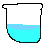

# Head

## Thing should or should't

>Don't make people angry
>
>And also dont *tring* to **hit** them
>>Amazing!

here are the following:
1. Be upset
2. Be talented
4. Not to be [ashamed][1]

tring are never stop:  
- happiness
- things cause trouble
- your daily life

`println!("my world's on me")`

---

```python
    import turtle
    t = turtle
    for i in range(4):
        t.fd(100)
        t.left(90)
    print("done!")
```

A sample for ***[You](https://example.com "Just an example")***

photo for you: 



<https://example.com>  
<fake@example.com>


[1]: https://example.com "example"